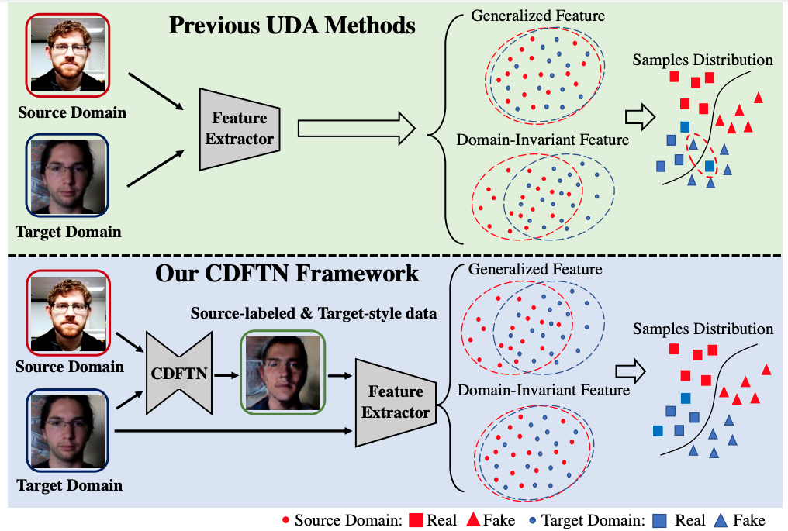
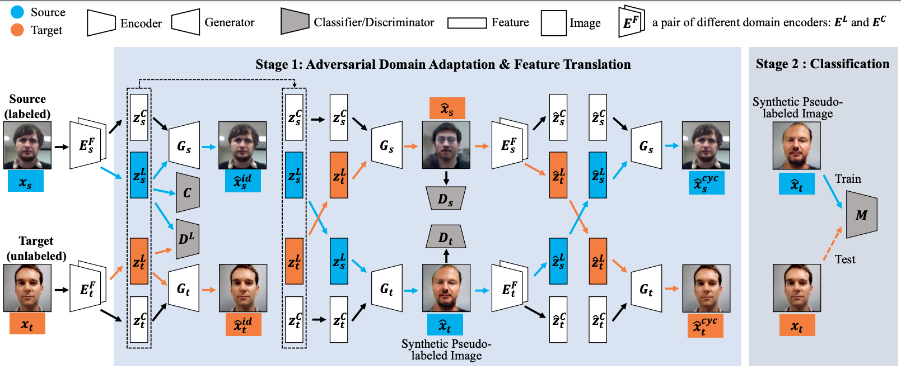

# CDFTN
This repo is the official implementation of our AAAI23 paper "Cyclically Disentangled 
Feature Translation for Face Anti-spoofing"

The framework comparison among our proposed method and previous UDA methods:

The overview of the model architecture:

## Requirement

## Data preparation

## Training

## Testing

## Citation